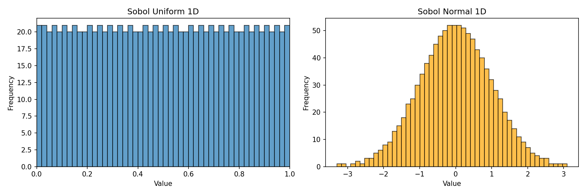

# jaxqmc

Quasi-Monte Carlo sampling with JAX.

## Installation

```bash
pip install jaxqmc
```

## Usage

```python
from jaxqmc import sobol_uniform_1d, sobol_normal_1d

u = sobol_uniform_1d(100)  # Uniform samples in [0, 1)
z = sobol_normal_1d(100)    # Standard normal samples
```

## Examples

Uniform and normal distributions generated with Sobol sequences:



## Testing

```bash
pytest tests/
```
